# ML-9 Team Project - Evaluating Machine Learning Methods for Reliable Stroke Classification

# Overview

Stroke, a leading cause of death and disability worldwide, places a significant burden on healthcare systems. In fact, yearly stroke-related health care costs in Ontario, Canada were estimated to be up to $40,000 as of 2018 [1] which has likely only increased since then. Early prediction and intervention are therefore crucial to reducing mortality, improving patient outcome and reducing the costs on the health care system. Machine learning approaches offer promising tools for enhancing stroke prediction by analyzing vast datasets to identify patterns and risk factors that traditional methods may overlook.

---

# Goals & Objectives

This project aims to develop a **predictive model** for **stroke risk** using demographic, health, and lifestyle data. By analyzing patterns in patient profiles, we seek to identify key indicators that contribute to stroke incidence and build a tool that can assist healthcare providers in early intervention and resource prioritization.

---

# Business Motivation

Stroke is a leading cause of death and long-term disability worldwide. Early detection and prevention are critical to reducing healthcare costs and improving patient outcomes. However, many healthcare systems lack scalable tools to assess stroke risk across diverse populations. By leveraging machine learning, we aim to provide a reproducible framework for risk assessment.

This project addresses that gap by:

* Building a data-driven model to predict stroke risk
* Identifying high-impact features for targeted screening
* Supporting public health strategies with actionable insights
* Enabling hospitals and clinics to prioritize care for at-risk individuals

---

# Stakeholders & Business Case

### Primary Stakeholders

- **Healthcare providers:**  Support clinical decision-making by identifying high-risk patients.
- **Policy Makers & Public Health Agencies:**  Inform resource allocation and preventive strategies.
- **Patients:**  Particularly those with cardiovascular disease risk factors.

### Secondary Stakeholders

- **Researchers in medical ML**
- **Healthcare systems**

---

# Narrative Summary

Before deciding on a project, we looked at multiple datasets related to healthcare and disease prediction. We wanted to score areas of study based on the number of features they measured, as well as the number of datapoints available. After evaluating several options, we selected the Kaggle Stroke Prediction Dataset due to its clinical relevance and rich feature variety.

However, we identified that the dataset suffers from severe class imbalance. To overcome this, we:

1. Cleaned and preprocessed data
2. Applied SMOTE augmentation
3. Trained Logistic Regression, Random Forest, and FCNN models
4. Evaluated with ROC-AUC, recall, F1, and confusion matrices
5. Analyzed feature importance

---

# Exploratory Data Analysis (EDA)

Our dataset consists of 11 variables for 5,110 patients, including the variable "stroke" which is 1 if a patient had a stroke or 0 otherwise. The remaining variables represent a patient's demographic, health, and lifestyle information.

* Age: age of patient
* Gender: gender of patient
* Hypertension: whether the patient has a hypertension
* Heart Disease: whether the patient has heart disease
* Ever Married: whether the patient is married
* Work Type: the type of employment the patient has
* Residence Type: the type of area where the patient resides
* Average Glucose Level: the patient's average glucose level
* BMI: the body mass index of the patient
* Smoking Status: the patient's smoking history/status

#### Class Distribution of Stroke

This bar plot shows the distribution of the target variable 'Stroke' across the dataset. As observed, the class distribution is highly imbalanced, where out of 5110 individuals, 4861 (95.13%) are labeled non-stroke and 249 (4.87%) are labeled stroke.

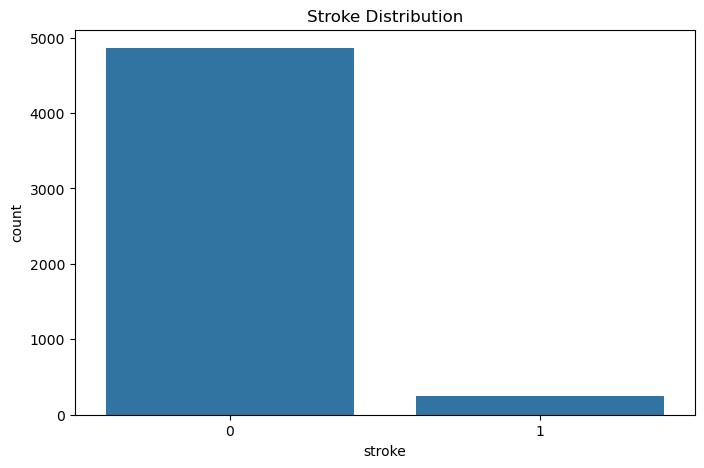

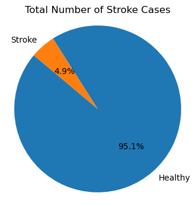

* Comparing stroke rates between gender:
  It is observed that the occurence of stroke in females slightly higher than males - 56.6% for females and 43.4% for males.

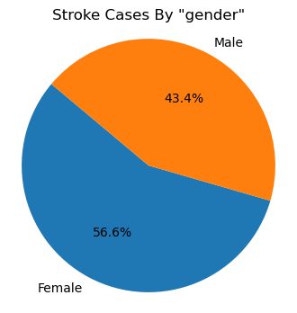

* Comparing stroke cases for ever_married, 88.4% of stroke patients did get married atleast once in their lifetime, however, 11.6% patients never got married.

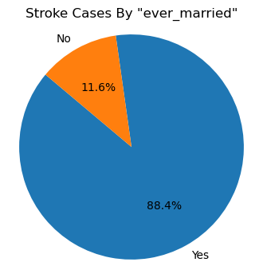

* Proportion of stroke by residence type:
  Overall 50.8% population is in urban areas and 49.2% in rural areas, 54.2% of the individuals who had a stroke are from urban areas and 45.8% are from rural areas.

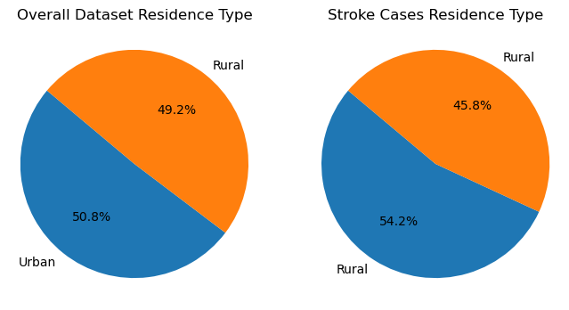

* Proportion of stroke by smoking_status:
  16.9% patients are smokers, 28.1% formerly smoked, 36.1% never smoked, and 18.9% unknown.

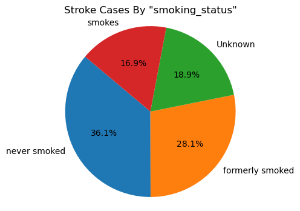

* Proportion of stroke by work_type:
  13.3% stroke patients are in govt. job, 26.1% are self-employed, 59.8% do private business, and 0.8% are children.

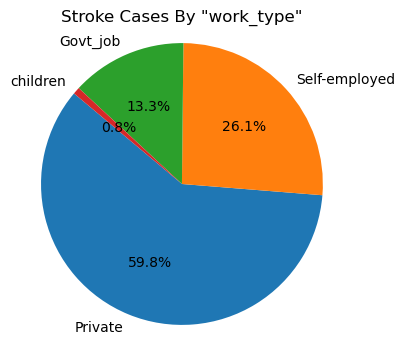

* Following is the Scatter Plot Matrix depicting data-points distribution of numeric variables:

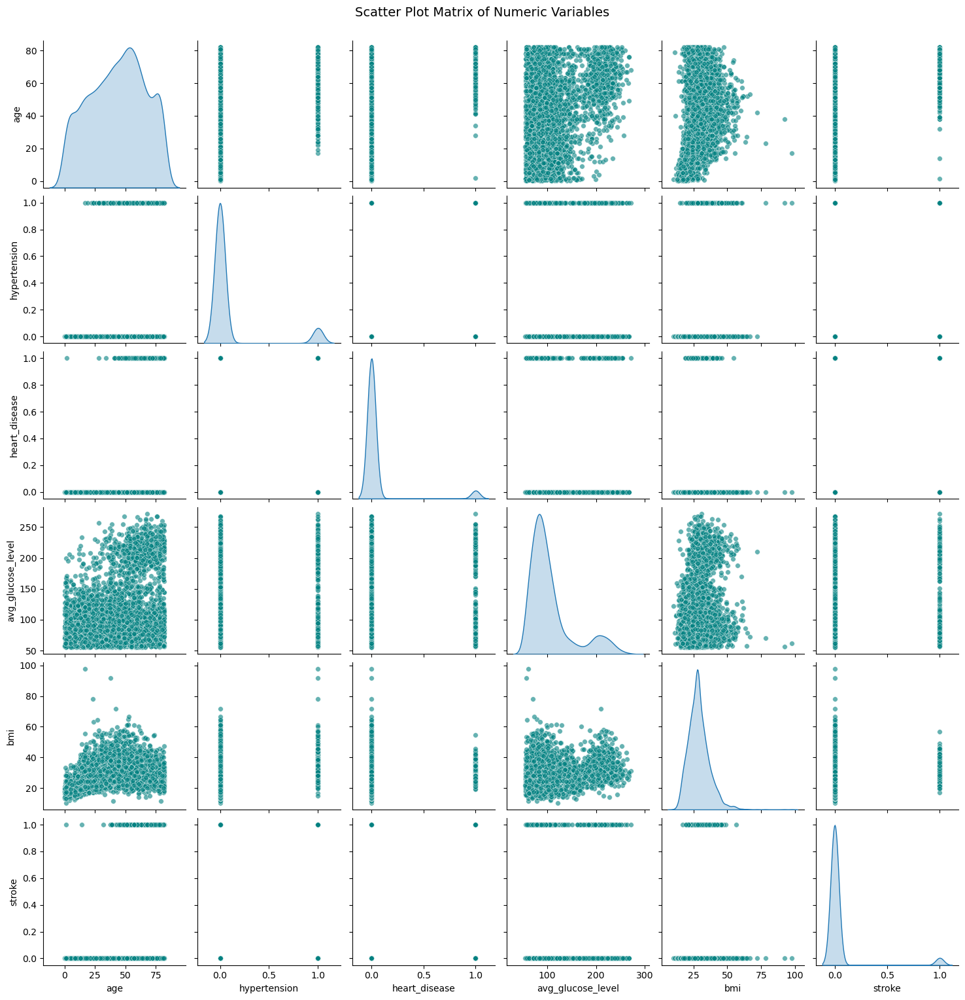

* Following are the Histograms depicting data distribution of numeric variables.

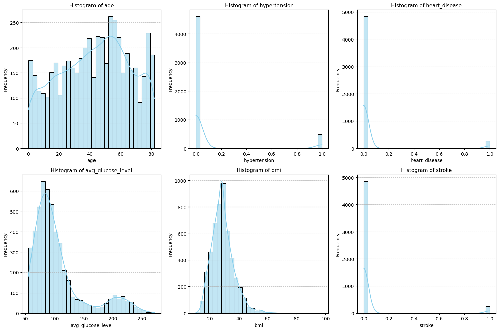

* Following is Feature Correlation Matrix which depicts correlation between features in our dataset, a strong correlation between stroke and age (0.25) can be seen in this matrix.

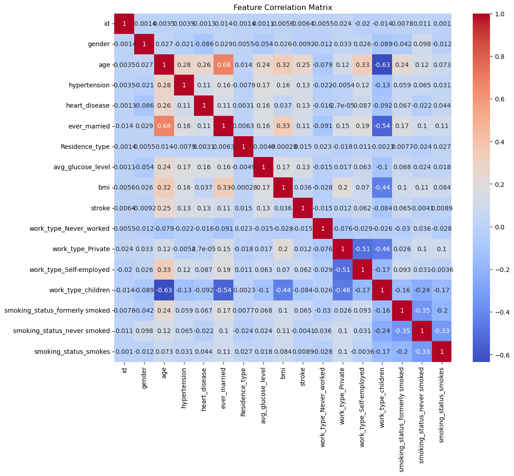

* Correlation of Stroke with bmi, avg_glucose_level, and age.

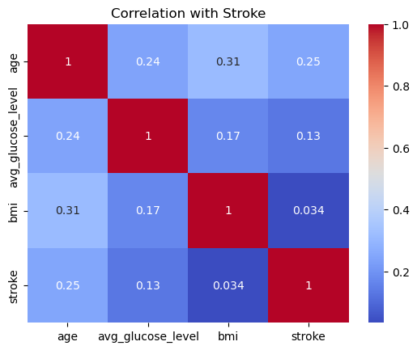

* Following chart depicts Age Distribution by Stroke chart, it is evident that risk of stroke starts gradually increasing after the age of 40 years.

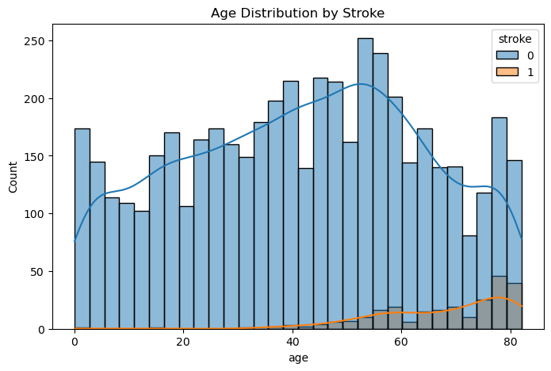

* Hypertension Distribution by Stroke Risk.

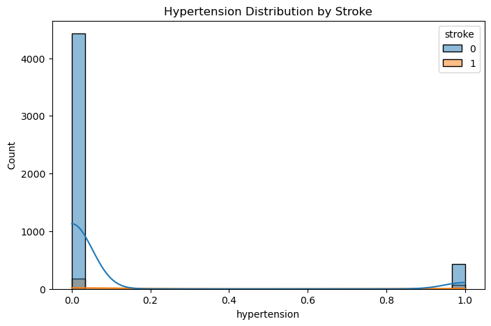

* Heart Disease Distribution by Stroke Risk.

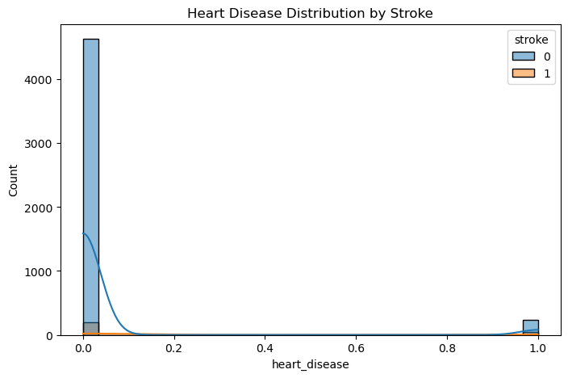

* Average Glucose Level Distribution by Stroke Risk.

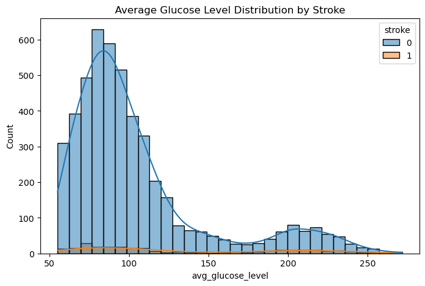

* BMI Distribution by Stroke Risk.

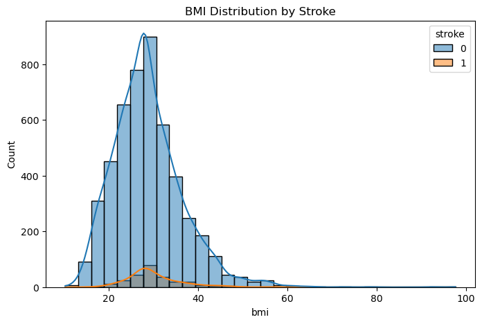

* Following bar charts depict Categorical Variables' Distribution by Stroke Risk.

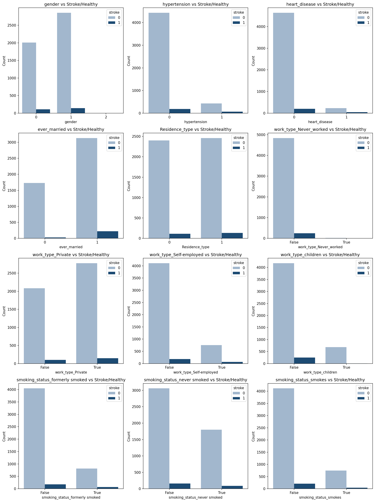

---

# Methodology

We developed a systematic approach to set up and evaluate multiple machine learning methods under severe class imbalance. We implemented and compared three models:

- **Logistic Regression:** Baseline interpretable model.
- **Random Forest:** Ensemble method to capture non-linear relationships.
- **Neural Networks:** Deep learning approach for complex feature interactions.

## Preprocessing

To begin with, we handled data quality issues:

- BMI median imputation to address missing values
- Encoding categorical variables with one-hot encoding
- Standardization for neural networks

## Addressing Class Imbalance

Given the extreme class imbalance (only ~5% affirmative stroke cases), we implemented several strategies:

- SMOTE
- Balanced class weights
- Stratified train/test splits

---

# Models Tested

We evaluated three main models:

- **Logistic Regression** – interpretable baseline
- **Random Forest** – most stable and accurate
- **FCNN** – prone to overfitting due to dataset size

---

# Evaluation Metrics

The following metrics were used to assess model performance:

- ROC-AUC; to measure overall discrimination
- Precision, Recall, F1; to evaluate minority class performance
- Confusion matrices; to visualize true vs. predicted classes
- SHAP values (Random Forest); to interpret feature importance

---

# Insights & Results

- **Age, avg_glucose_level, and BMI** were the strongest predictors of stroke risk.
- **Stroke Prevalence**: Stroke cases are relatively rare in the dataset.
- **Age Factor**: Stroke risk increases significantly with age, especially beyond 60.
- **Health Indicators**:
  - Higher average glucose levels and BMI are associated with stroke cases.
  - Hypertension and heart disease show correlation with stroke.
- **Lifestyle Factors**:
  - Smoking status (especially current and former smokers) correlates with higher stroke risk.
- **Feature Importance**:
  - Top predictors include `age`, `avg_glucose_level`, `bmi`, `hypertension`, and `heart_disease`.

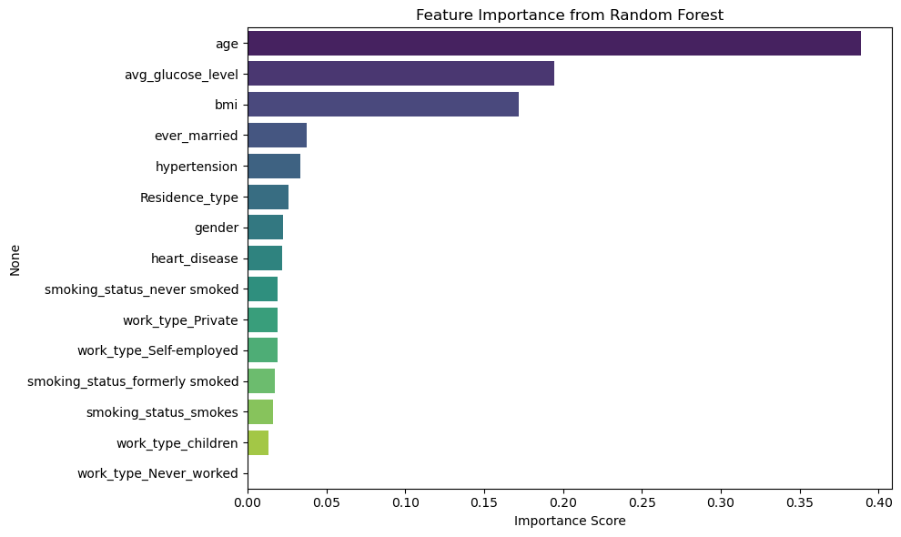

**In looking at the findings from our experiments, we looked at the stated evaluation metrics:**

## Random Forest Outperformed All Other Models

We found, after looking at our results, that Random Forest was the best model by several key metrics:

- Highest ROC-AUC
- Best stroke-case recall
- Most balanced across metrics
- Most stable across splits

**Final Tuned Random Forest Performance**

| Metric     | Class 0 | Class 1 | Overall |
| ---------- | :-----: | :-----: | :-----: |
| Prediction |  0.96  |  0.95  |        |
| Recall     |  0.96  |  0.96  |        |
| F1-score   |  0.96  |  0.96  |        |
| Accuracy   |    -    |    -    |  0.96  |
| ROC-AUC    |    -    |    -    |  0.99  |

## Neural Networks Underperformed

Challenges with FCNN we discovered included:

- Overfitting
- Inconsistent performance
- Lower minority recall

**Final Tuned FCNN Performance**

| Metric     | Class 0 | Class 1 | Overall |
| ---------- | :-----: | :-----: | :-----: |
| Prediction |  0.94  |  0.82  |        |
| Recall     |  0.81  |  0.94  |        |
| F1-score   |  0.87  |  0.88  |        |
| Accuracy   |    -    |    -    |  0.88  |
| ROC-AUC    |    -    |    -    |  0.96  |

## Logistic Regression Was Too Simple

We expected LR to underperform, as we were simply using it as a baseline. Here were its issues if we were to look at it for direct use:

- Low recall for minority class
- Underfit nonlinear interactions

**Final Tuned Logistic Regression Performance**

| Metric    | Class 0 | Class 1 | Overall |
| --------- | :-----: | :-----: | :-----: |
| Precision |  0.87  |  0.85  |        |
| Recall    |  0.86  |  0.86  |        |
| F1-score  |  0.86  |  0.85  |        |
| Accuracy  |    -    |    -    |  0.86  |
| ROC-AUC   |    -    |    -    |  0.94  |

## Final Model Comparison

| Model               | Accuracy | ROC-AUC | F1-score | Class 1 Recall | Notes                 |
| ------------------- | :------: | :-----: | -------- | :------------: | --------------------- |
| Logistic Regression |   0.86   |  0.94  | 0.86     |      0.86      | Transparent, reliable |
| Random Forest       |   0.96   |  0.99  | 0.96     |      0.96      | Best overall          |
| FCNN                |   0.88   |  0.96  | 0.88     |      0.94      | High recall, flexible |

## Predictive Features (Random Forest)

We identified key predictive features using SHAP values from the Random Forest model(because it was the best performing model). Top features included:

- Age
- Avg glucose level
- Hypertension
- Heart disease
- BMI
- Smoking status

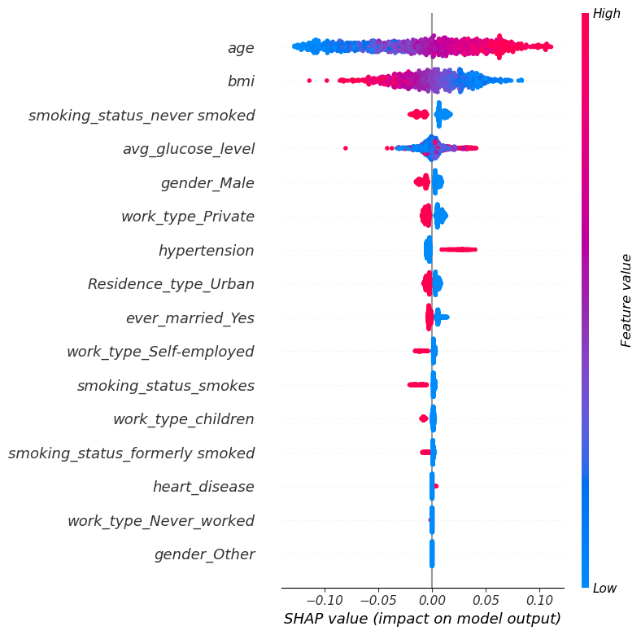

---

# Data Augmentation Was Essential

A critical insight from our experiments was the impact of data augmentation, particularly SMOTE:
Without augmentation:

- Minority recall was near zero
- Models predicted almost exclusively “no stroke”

With augmentation:

- Metrics became meaningful
- Random Forest clearly best

---

# Risks and Limitations

This dataset and approach have several limitations:

- Class imbalance persists even after augmentation
- Small dataset limits DL performance
- Dataset may not generalize to wider populations
- Synthetic oversampling can introduce noise

---

# Reproducibility & Setup Instructions

## Local Setup

### Clone

```
git clone https://github.com/ML-9/ML-9-Team-Project
cd ML-9-Team-Project
```

### Install

```
conda create -n ml9 python=3.10
conda activate ml9
pip install -r requirements.txt
```

### Run

```
jupyter lab
```

# Docker (Reproducible Environment)

Included files:

- Dockerfile
- docker-compose.yml
- .dockerignore

## Quick Start

### Build

```
docker build -t ml9-team-project:latest .
```

### Run

```
docker-compose up --build
```

### Access Jupyter

```
http://localhost:8888
```

### Run Notebooks

Open and run the Jupyter notebooks in the `process/` directories. Specifically, to recreate the experiments, look in the `Experiments` directory.

---

# Credits and links to personal videos

* [Andrew Harris](https://github.com/ML-9/ML-9-Team-Project/blob/main/VideoSubmissions/andrew_video.md)
* [Christina Lamparter](https://github.com/ML-9/ML-9-Team-Project/blob/main/VideoSubmissions/Christina_Reflection.pptx)
* [Rahele Mosleh](https://github.com/ML-9/ML-9-Team-Project/blob/main/VideoSubmissions/Rahele_Videos.mp4)
* [Shahid Khokhar](https://github.com/ML-9/ML-9-Team-Project/blob/main/VideoSubmissions/Shahid-Video.mp4)

---

# References

[1] Vyas et al., Stroke 2023
[2] Vu et al., J Cardiovasc Dev Dis 2024
[3] Moulaei et al., Sci Rep 2024
